# Logic Diagram for [code.py](file:///Users/workflow/FHNW%20git/FS2026%20git/idb/bed_room_condition/code.py)

This document contains a Mermaid flow diagram and a detailed description of the logic implemented in [code.py](file:///Users/workflow/FHNW%20git/FS2026%20git/idb/bed_room_condition/code.py). The system monitors bedroom conditions (CO2, temperature, humidity, noise, light, gases), displays key readings locally, and publishes data to the ThingSpeak cloud service via MQTT.

## Mermaid Flowchart

```mermaid
flowchart TD
    Start([Start]) --> InitConsts[Initialize constants & pins]
    InitConsts --> InitSensors["Initialize sensors & displays:<br>Light, Sound, SCD30, TM1637, RGB LED, Green LED"]
    InitSensors --> TestDisplays["Self-test indicators:<br>1. Show '8888' on TM1637 for 0.6s<br>2. Turn on Green LED for 0.6s"]
    
    TestDisplays --> InitWatchdog["Configure Watchdog Timer:<br>60s timeout, RESET mode"]
    
    InitWatchdog --> ConnectWiFi{Connect to WiFi}
    ConnectWiFi -->|Error / Attempt| FeedWD1[Feed Watchdog]
    FeedWD1 --> ConnectWiFi
    ConnectWiFi -->|Success| ConnectMQTT{Connect to MQTT}
    
    ConnectMQTT -->|Error / Attempt| FeedWD2["Feed Watchdog & Check WiFi"]
    FeedWD2 --> ConnectMQTT
    ConnectMQTT -->|Success| GasCalibration["Calibrate gas sensor:<br>Take 5 samples for baseline"]
    
    GasCalibration --> MainLoop[Begin Main Loop]
    
    MainLoop --> FeedWD3[Feed Watchdog]
    FeedWD3 --> ReadAnalog["Read analog sensors:<br>1. Light level<br>2. Sound level peak-to-peak over 32 samples"]
    
    ReadAnalog --> CheckSCD30{SCD30 data available?}
    CheckSCD30 -->|Yes| ProcessSCD30[Read CO2, Temp offset, Humidity]
    ProcessSCD30 --> DisplayTemp[Display Temp on TM1637]
    DisplayTemp --> SetRGBLED{What is the CO2 level?}
    
    SetRGBLED -->|CO2 <= 650 ppm| LEDBlue[RGB LED = Blue]
    SetRGBLED -->|650 < CO2 <= 1000 ppm| LEDGreen[RGB LED = Green]
    SetRGBLED -->|CO2 > 1000 ppm| LEDRed[RGB LED = Red]
    
    LEDBlue & LEDGreen & LEDRed --> CheckHumidity["Humidity out of range<br>(40% to 60%)?"]
    CheckHumidity -->|Yes| GreenLEDOn[Turn ON emergency Green LED]
    CheckHumidity -->|No| GreenLEDOff[Turn OFF emergency Green LED]
    
    CheckSCD30 -->|No| ReadGas["Read Gas Sensor V2:<br>NO2, Ethanol, VOC, CO"]
    GreenLEDOn & GreenLEDOff --> ReadGas
    
    ReadGas --> CalcGasPct[Calculate gas % change from baseline]
    CalcGasPct --> CheckPublish["Interval >= 15s Passed<br>AND all sensors have data?"]
    
    CheckPublish -->|Yes| PublishMQTT[Publish field1..field8 to ThingSpeak]
    PublishMQTT -->|Success| UpdatePublishTime[Update last_publish = now]
    PublishMQTT -->|Error| ReconnectMQTT[MQTT disconnect & Reconnect MQTT]
    
    CheckPublish -->|No| LoopSleep[Sleep 2.0s & Feed Watchdog]
    UpdatePublishTime & ReconnectMQTT --> LoopSleep
    
    LoopSleep --> MainLoop
    
    %% Loop exceptions
    MainLoop -.->|Loop Exception| LoopError[Log error & Sleep 2.0s]
    LoopError -.-> MainLoop
```

## Detailed Block Descriptions

1. **Initialization & Self-Test**:
   - The program starts by configuring pins for analog sensors (light and sound), setting up I2C buses, and initializing the [SCD30](file:///Users/workflow/FHNW%20git/FS2026%20git/idb/bed_room_condition/code.py#L62) sensor, TM1637 display, chainable LED, and Green LED.
   - It performs a brief self-test by turning on all TM1637 segments (`8888`) and lighting up the emergency Green LED for 0.6 seconds to verify physical connection.

2. **Watchdog Protection**:
   - An internal [Watchdog](file:///Users/workflow/FHNW%20git/FS2026%20git/idb/bed_room_condition/code.py#L121) is enabled with a 60-second timeout. If the program gets blocked in network loops or crashes, the microcontroller will automatically reset.

3. **WiFi & MQTT Setup**:
   - Connections are established using the ESP32 AirLift chip. During WiFi connection attempts, the RGB LED glows white.
   - Once connected, it connects to the ThingSpeak MQTT broker. If successful, the RGB LED flashes green for 1 second, then turns off until the first CO2 reading.

4. **Gas Sensor Calibration**:
   - The program reads 5 samples from the Multichannel Gas Sensor V2 to establish a baseline for NO2, Ethanol, VOC, and CO. Future readings are formatted with the percentage change relative to this baseline.

5. **Main Monitoring Loop**:
   - **Analog Sensors**: Light levels are read directly. Sound levels are computed by taking the peak-to-peak amplitude over 32 samples to capture dynamic noise like speech or music rather than ambient background offset.
   - **SCD30 Sensor**: When new data is available:
     - Applies a temperature offset (`-2.0` °C) and displays the temperature on the 4-digit display.
     - Maps CO2 levels to colors: Blue (<= 650 ppm, fresh), Green (<= 1000 ppm, good), or Red (> 1000 ppm, needs ventilation).
     - Turns on the secondary Green LED if the relative humidity falls outside the comfortable range (40% to 60%).
   - **ThingSpeak MQTT Publishing**: The data is published every 15 seconds. If the publish fails, it automatically triggers an MQTT reconnection logic.
